# Power BI and SQL on-demand

Several new features of Azure Synapse Analytics have just entered public preview, and for me the most interesting by far is the new [SQL on-demand](https://docs.microsoft.com/en-us/azure/synapse-analytics/sql/on-demand-workspace-overview). In this post I am simply exploring several potential scenarios this new capability unlocks. 

As a quick refresher, SQL on-demand is defined by the Microsoft documentation as: *a query service over the data in your data lake. It enables you to access your data through the following functionalities:*
 - *A familiar T-SQL syntax to query data in place without the need to copy or load data into a specialized store.*
 - *Integrated connectivity via the T-SQL interface that offers a wide range of business intelligence and ad-hoc querying tools, including the most popular drivers.*

I will note that the documentation defines the logical data warehouse (a relational abstraction on top of raw or disparate data without relocating and transforming data, allowing always up-to-date view of your data) as a suitable scenario for the SQL on-demand, which greatly fits in with the scenarios below: 

## 1. Power BI datasets directly on top of the data lake 
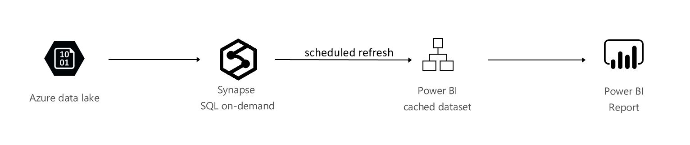

Refresh a Power BI dataset directly from the data lake, using SQL on-demand. This scenario does not need a provisioned SQL Pool (previously known as SQL Data Warehouse) and relies on the SQL on-demand query service for the compute needed to refresh the Power BI dataset. 

**Step 1**: create an Azure Synapse Analytics workspace. As the SQL on-demand feature is still in preview at the time of this writing, make sure you select the Azure Synapse Analytics (workspace preview) version.

**Step 2**: launch Synapse Studio.

**Step 3**: using the SQL on-demand engine, create a view over data stored in the underlying data lake. In this example, I am creating a view called vPopulation in a database called onDemandDB, exposing population data from a sample storage account. If you want to follow along, or get more details on how this is done, please refer to [this tutorial](https://docs.microsoft.com/en-us/azure/synapse-analytics/sql/query-single-csv-file)(make sure to run the setup script in the tutorial).

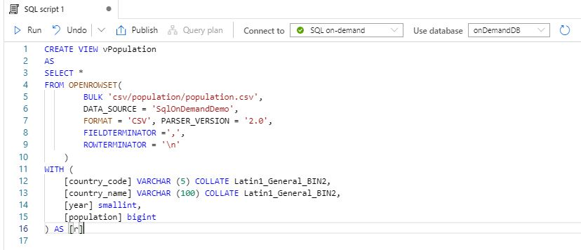
  
**Step 4**: go back to the Overview blade of your Synapse Workspace (in the Azure portal, outside of the Synapse Studio), and take note of the name of the SQL on-demand endpoint. 

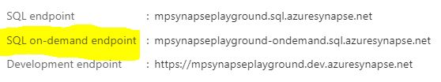

**Step 5**: start Power BI Desktop and create a connection to Azure SQL Database. Enter the SQL on-demand endpoint name as the server name, then the database name and **Import** as the connectivity option.

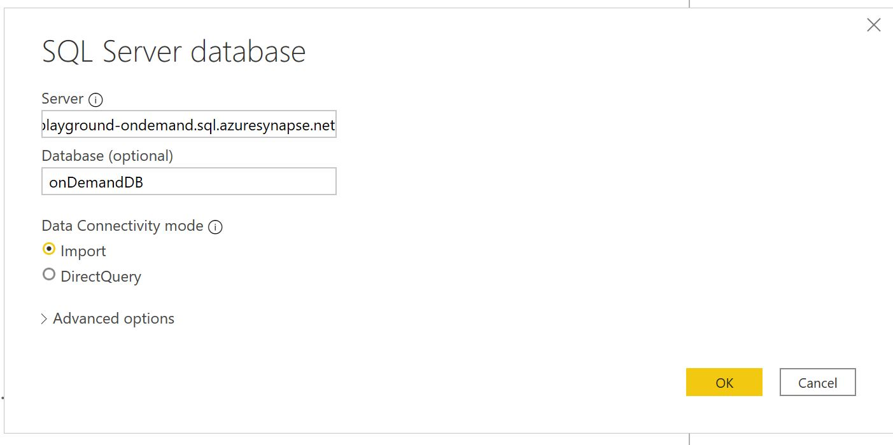

**Step 6**: once you enter the correct authentication, you should see all the views and tables available in the on demand database, including vPopulation in this case.

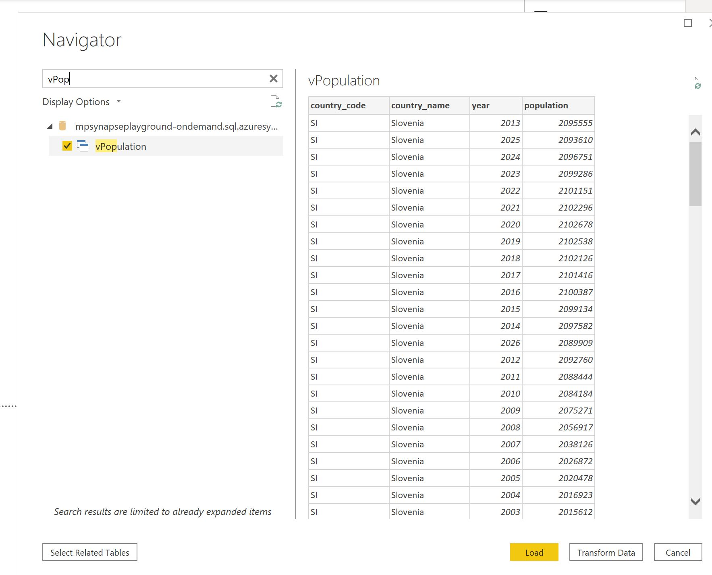

**Step 7**: build a Power BI report on top of the imported data and publish it to the Power BI service 

**Step 8**: schedule a refresh for the dataset 

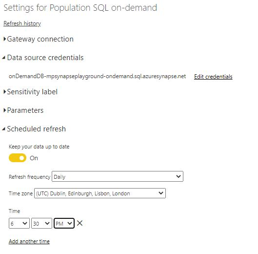

## 2. Power BI 2-part aggregation: cached dataset > SQL on-demand
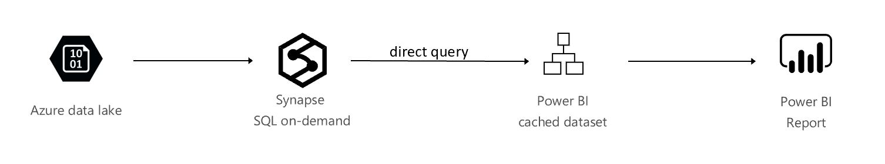

Create a Power BI dataset that will cache the summarized data in memory, and drill-down to the SQL on-demand query service for the detailed data. In this case, most user queries should hit the cache, but the on-demand query engine will support the occasional drill-down.  This scenario does not need a provisioned SQL Pool (previously known as SQL Data Warehouse).

**Step 1** to **Step 4** are identical to scenario 1. 

**Step 5**: start Power BI Desktop and create a connection to Azure SQL Database. Enter the SQL on-demand endpoint name as the server name, then the database name and **Direct Query** as the connectivity option.

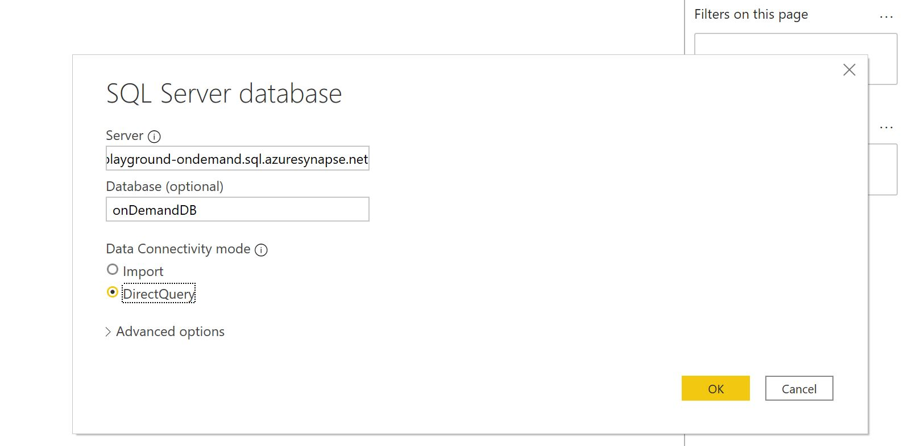

**Step 6**: create an aggregate table and set it as **Import** in Power BI. In this example, I will create an aggregate table that groups the population number by year. Please note that only the aggregate table should be cached. 

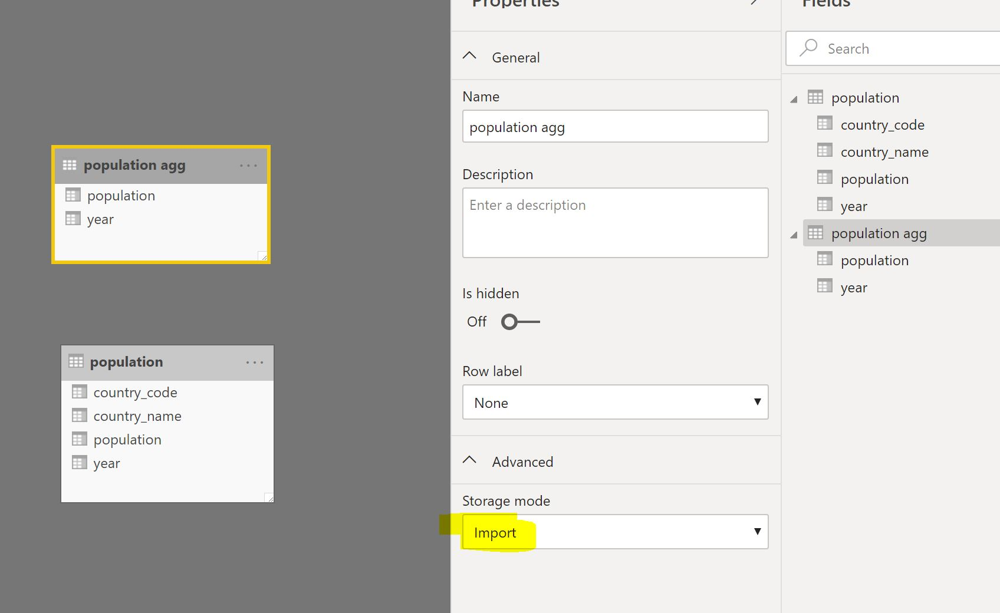

**Step 7**: mark the aggregate table as aggregate via the manage aggregations option in Power BI.

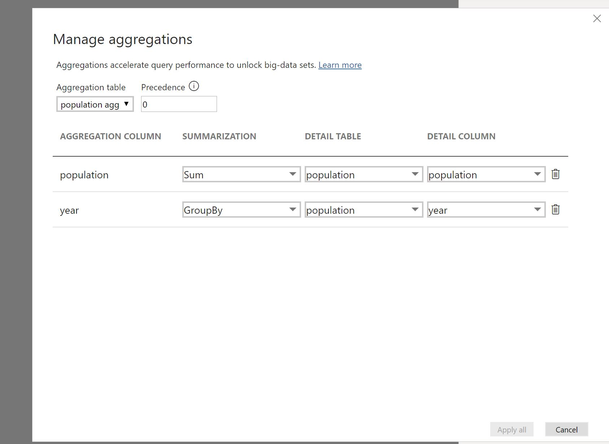

Any visual using data only from the aggregated table (population by year) will be served from memory. Any visual using data fields that are not present in the aggregated table (population by country_name) will be served by the SQL on-demand query service. 

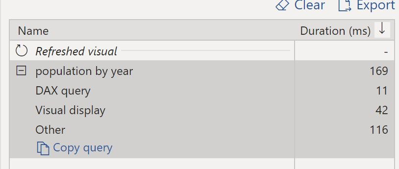

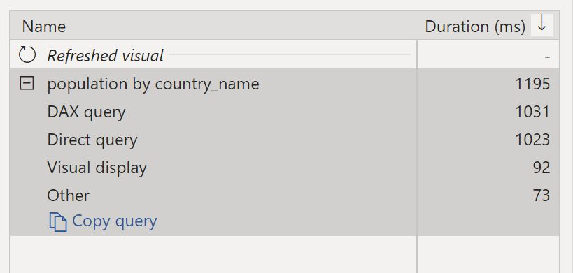

## 3. Power BI 3-part aggregation: cached dataset > SQL Pool > SQL on-demand
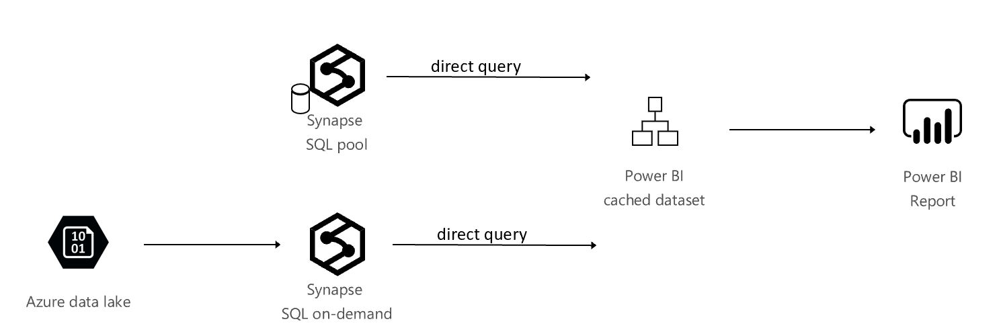
  
*tutorial to follow*

## Additional resources
- [Azure Synapse Analytics (workspace preview)](https://docs.microsoft.com/en-gb/azure/synapse-analytics/overview-what-is)
- [Power BI Aggregations](https://docs.microsoft.com/en-us/power-bi/transform-model/desktop-aggregations)
